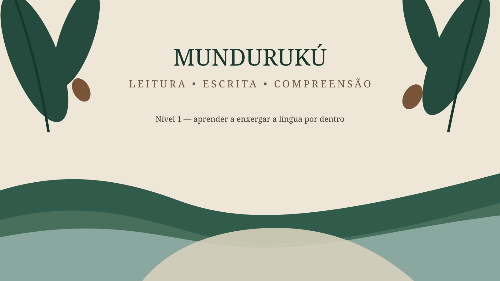
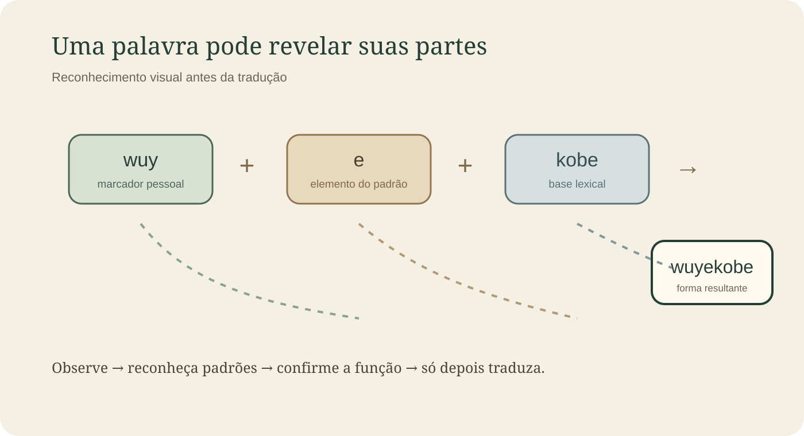
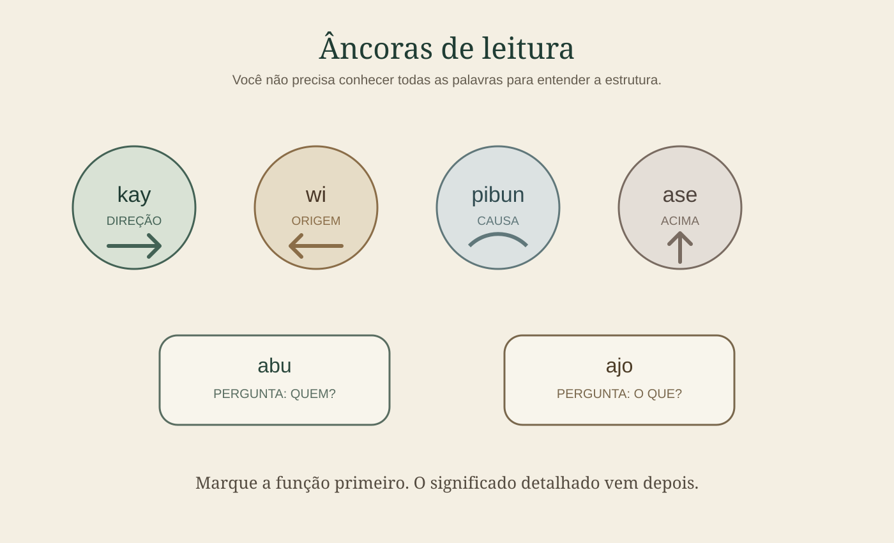

# Nível 1 — Fundamentos de leitura e escrita

Neste primeiro nível, o objetivo é deixar de enxergar a escrita Mundurukú como uma sequência desconhecida de letras e começar a reconhecer **padrões, partes, relações e funções gramaticais**.

Você vai avançar nesta ordem:

**forma gráfica → reconhecimento → estrutura → compreensão → escrita**

A tradução para o português é usada como apoio, nunca como único método. Quanto mais a apostila avançar, menos português será necessário.

Ao terminar o Nível 1, você deverá conseguir observar formas desconhecidas, reconhecer parte da estrutura e continuar lendo sem interromper o estudo para traduzir cada palavra.