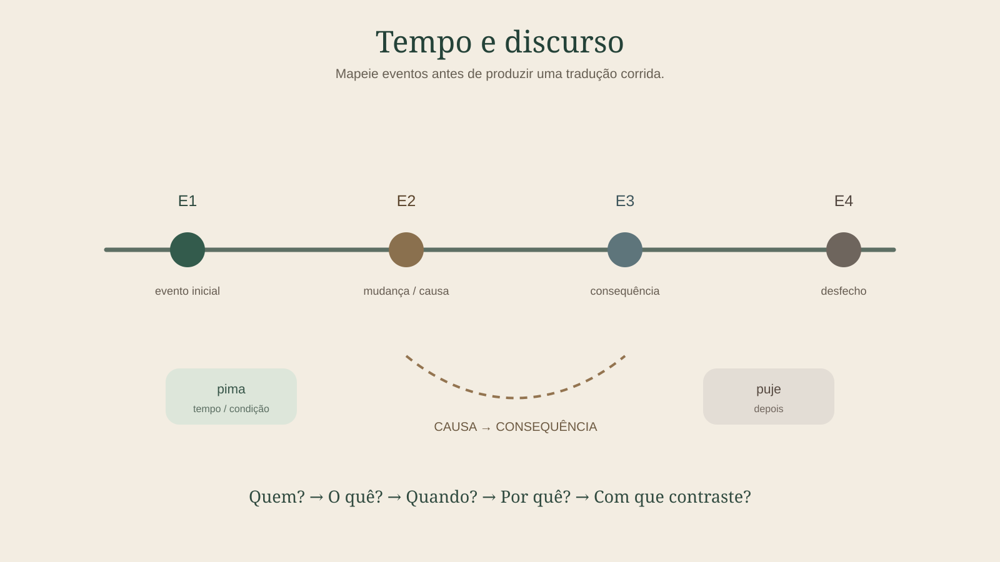

# Capítulo 26 — Do período ao parágrafo

Ler uma frase é diferente de ler um parágrafo. No parágrafo, você precisa acompanhar **continuidade de referência, sequência de eventos, causa, contraste, foco e mudanças de cenário**.

---

## 1. Pare de analisar frases como ilhas

Uma oração pode conter uma forma difícil que só fica clara quando você lê:

- a oração anterior;
- a oração seguinte;
- quem já foi mencionado;
- qual evento está em foco.

A partir de agora, nunca faça análise avançada de uma oração sem olhar o entorno textual.

---

## 2. Participantes ativos

Antes de ler um parágrafo, crie uma pequena lista:

`A` — participante principal

`B` — segundo participante

`C` — terceiro participante

Quando um nome reaparece por pronome, marcador pessoal ou retomada anafórica, mantenha a mesma letra.

Se surgir um referente realmente novo, crie outra.

---

## 3. Linha do tempo

Marque relações temporais:

`bima/pima` → antes / enquanto / quando, conforme contexto

`buje/puje` → depois

advérbios temporais → posição do evento na sequência

aspecto → modo como o evento é apresentado

Desenhe:

`E1 → E2 → E3`

ou, quando houver simultaneidade:

`E1 ║ E2`

Isso transforma uma narrativa difícil em mapa.

---

## 4. Causa e condição

Marque em outra camada:

`CAUSA → CONSEQUÊNCIA`

`CONDIÇÃO → RESULTADO`

Conjunções e posposições estudadas fornecem pistas diferentes. Não reduza tudo a uma única tradução portuguesa.

---

## 5. Contraste

Partículas como `bit/pit` avisam que existe oposição relevante.

Quando encontrar contraste:

1. volte uma ou duas frases;
2. localize a informação anterior;
3. escreva A × B na margem;
4. determine exatamente o que mudou.

Sem essa etapa, uma narrativa pode parecer contraditória quando na verdade está corrigindo ou contrapondo informação.

---

## 6. Restrição e inclusão

`acã` → restrição

`dak/tak` → inclusão

Essas partículas ajudam a acompanhar como o conjunto de participantes ou possibilidades é alterado.

Exemplo abstrato:

conjunto `{A, B, C}`

`acã` pode restringir a leitura a um membro ou subconjunto.

`dak/tak` pode acrescentar um elemento ao conjunto discursivo relevante.

---

## 7. Inferência e certeza

Quando aparece `aco'i`, coloque um símbolo `?` na margem.

Isso não significa que a frase é falsa. Significa que a fonte da informação ou o grau de compromisso do falante exige atenção.

Em narrativas, diferencie:

- evento afirmado;
- evento inferido;
- evento relatado por terceiros;
- evento hipotético.

---

## 8. Resumo estrutural antes do resumo em português

Depois de ler um parágrafo, não escreva imediatamente uma tradução.

Primeiro faça algo como:

`A age sobre B → depois C aparece → causa X → contraste com informação anterior → resultado Y`

Só então escreva o resumo natural.

Esse procedimento reduz a influência da sintaxe portuguesa sobre sua compreensão.

---

## 9. Exercício

Para cada parágrafo que estudar daqui em diante, produza cinco linhas:

1. participantes: __________________
2. sequência temporal: __________________
3. relações de causa/condição: __________________
4. foco/contraste: __________________
5. resumo de uma frase: __________________

Se não conseguir preencher uma linha, volte apenas ao trecho necessário.

---

## 10. Meta de domínio

Avance quando conseguir:

- acompanhar participantes entre orações;
- construir uma linha temporal;
- separar causa de condição;
- identificar contraste e restrição;
- registrar grau de certeza;
- resumir um parágrafo sem traduzir palavra por palavra.