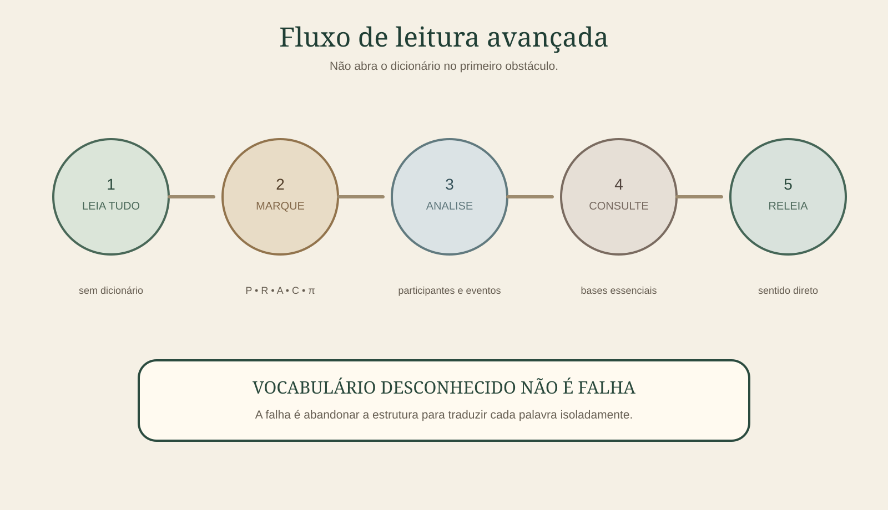

# Capítulo 29 — Protocolo de leitura avançada

Neste estágio, a meta não é reconhecer uma lista fechada de regras. É conseguir abrir um texto Mundurukú que você nunca estudou e ter um procedimento para enfrentá-lo sem depender de tradução pronta.

---

## 1. Passagem zero — identifique a fonte

Antes de ler:

- autor ou produtor;
- data;
- gênero textual;
- convenção ortográfica;
- origem do texto;
- existência de tradução ou análise publicada.

Isso evita misturar grafias e ajuda a interpretar escolhas discursivas.

---

## 2. Passagem um — leitura integral

Leia o trecho inteiro sem dicionário.

Não tente resolver tudo.

Marque apenas:

- palavras reconhecidas;
- conectores;
- partículas;
- demonstrativos;
- formas verbais aparentes.

No fim, escreva uma hipótese de duas linhas sobre o texto.

---

## 3. Passagem dois — predicados

Agora localize os predicados.

Para cada um, tente identificar:

- classe verbal;
- pessoa;
- aspecto;
- relacional;
- objeto;
- incorporação;
- reduplicação;
- derivação.

Não traduza ainda.

---

## 4. Passagem três — participantes

Crie uma tabela:

| Participante | Primeira menção | Retomadas | Papel atual |
|---|---|---|---|
| A | ______ | ______ | ______ |
| B | ______ | ______ | ______ |
| C | ______ | ______ | ______ |

Siga pronomes, demonstrativos, clíticos e anáforas.

---

## 5. Passagem quatro — arquitetura do discurso

Marque:

- sequência temporal;
- causa;
- condição;
- contraste;
- restrição;
- inclusão;
- informação de baixa certeza;
- foco.

Agora você já deve conhecer o esqueleto do texto.

---

## 6. Passagem cinco — consulta lexical

Só agora abra o dicionário.

Prioridade:

1. bases verbais desconhecidas;
2. nomes centrais;
3. palavras repetidas;
4. formas que bloqueiam uma relação importante;
5. vocabulário periférico por último.

Registre a base e não apenas a forma encontrada.

---

## 7. Passagem seis — análise de dúvidas

Para cada ponto ainda obscuro, escreva uma hipótese explícita:

`H1:` __________________

`evidência:` __________________

`contraevidência:` __________________

`status:` confirmado / provável / dúvida

Uma hipótese escrita é mais fácil de corrigir do que uma impressão vaga.

---

## 8. Passagem sete — compreensão direta

Leia novamente sem olhar para suas traduções.

Agora tente visualizar o evento e as relações diretamente.

Se você entende o parágrafo, mas ainda não sabe como traduzi-lo elegantemente para português, isso é um **bom sinal**: compreensão e tradução começaram a se separar.

---

## 9. Passagem oito — tradução de controle

Produza uma tradução natural apenas para verificar se o sentido geral foi preservado.

Depois compare com uma tradução publicada, se existir.

Analise diferenças em:

- participantes;
- aspecto;
- causalidade;
- referência;
- foco;
- certeza.

Essas diferenças importam mais do que escolher exatamente a mesma palavra portuguesa.

---

## 10. Passagem nove — escrita

Escolha apenas estruturas que você já domina e produza:

- uma reconstrução;
- uma transformação de pessoa;
- uma transformação aspectual documentada;
- uma paráfrase possível somente quando houver modelos seguros;
- uma análise morfológica completa.

A produção livre total vem por último.

---

## 11. Critério de autonomia

Você alcançou leitura avançada funcional quando consegue:

- começar um texto sem tradução;
- localizar estrutura gramatical;
- tolerar vocabulário desconhecido;
- usar dicionário pela base;
- seguir referência entre orações;
- reconhecer foco e modalização;
- justificar suas análises com evidência;
- perceber quando ainda não sabe algo.

A última habilidade é tão importante quanto as demais.